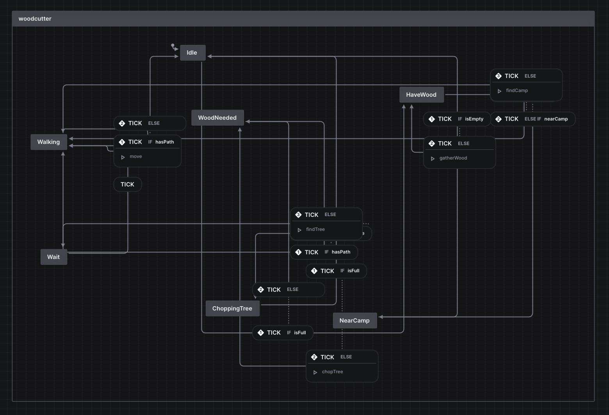

# Medieval - Realtime 3D RTS Game


**Medieval** is a real-time 3D RTS game built with React, TypeScript, Three.js, and Vite. This repository contains everything you need to run, develop, and build the game.

## Demo

Access the latest deploy at: https://code-cooking-team.github.io/Medieval/

## Table of Contents

- [Tech Stack](#tech-stack)
- [Getting Started](#getting-started)
- [Available Scripts](#available-scripts)
- [Project Structure](#project-structure)
- [Running Tests](#running-tests)
- [Contributing](#contributing)

## Tech Stack

- React 18
- TypeScript
- Vite
- Three.js
- Emotion (styled)
- Radix UI (Accordion, Slider, Switch, Tabs)
- Vitest + Happy DOM

## Getting Started

### Prerequisites

- Node.js v16+
- pnpm (https://pnpm.io)

### Installation

```bash
pnpm install
```

### Development Server

```bash
pnpm run dev
# opens http://localhost:3333/
```

### Building for Production

```bash
pnpm run build
pnpm run preview
```

## Available Scripts

| Command             | Description                         |
| ------------------- | ----------------------------------- |
| `pnpm run dev`      | Start the development server        |
| `pnpm run build`    | Compile TypeScript and build assets |
| `pnpm run preview`  | Preview production build locally    |
| `pnpm run format`   | Format code with Prettier           |
| `pnpm run test`     | Run unit tests with Vitest          |
| `pnpm run coverage` | Run tests with coverage report      |
| `pnpm run ts`       | Type-check the project              |

## Project Structure

```plaintext
Medieval/
├── src/
│   ├── App.tsx             # Root React component
│   ├── main.tsx            # Application entry point
│   ├── index.css           # Global styles
│   ├── config/             # Configuration loader & schemas
│   ├── game/               # Core game engine
│   │   ├── const.ts        # Engine constants (e.g., model names)
│   │   ├── types.ts        # Common engine types & enums
│   │   ├── Game.ts         # Main game loop, actor management & events
│   │   ├── Renderer.ts     # Rendering pipeline setup (Three.js)
│   │   ├── actors/         # Actor definitions, blueprints, renderers, & 3D models
│   │   │   ├── buildings/      # Building actors (house, barracks, etc.)
│   │   │   ├── buildingTraits/ # Shared building capabilities
│   │   │   ├── flora/          # Plant/Tree actors & renderers
│   │   │   └── units/          # Unit actors (humans, boars) & renderers
│   │   ├── algorithm/      # Utility algorithms (e.g., flood fill)
│   │   ├── core/           # Core classes (Actor, Pathfinding, FSM machine, Camera)
│   │   ├── maps/           # Map configurations & tile data (de_grass, Island, etc.)
│   │   ├── player/         # Player implementations, interactions & helpers
│   │   │   └── interaction/   # Input & selection handlers
│   │   ├── professions/    # Professions & related machines (woodcutter, guardian)
│   │   ├── renderer/       # Rendering utilities & helper classes
│   │   │   └── textures/      # Environment textures
│   │   └── world/          # World grid, tiles, codes & World class
│   ├── helpers/            # General utility functions & tests
│   ├── lib/                # Shared libraries (Event Emitter)
│   └── ui/                 # UI components, hooks, and styles
│       ├── components/     # Reusable UI components
│       ├── hooks/          # Custom React hooks
│       ├── modules/        # Domain-specific UI modules
│       └── styles/         # Design system & snippets
├── public/                 # Static files and assets (if any)
├── index.html              # HTML template
├── vite.config.ts          # Vite configuration
├── vitest.config.ts        # Vitest configuration
├── tsconfig.json           # TypeScript configuration
└── package.json            # Project metadata & scripts
```

## Engine Deep Dive

### Actors & Blueprints

Actors extend core classes and use Blueprints for static data (meshes, config points). A Blueprint defines mesh paths and layout, while an Actor class handles state, interactions, and serialization.

Example: `src/game/actors/buildings/woodCamp/WoodCampActor.ts`

```ts
export class WoodCampActor extends BuildingActor {
  type = ActorType.WoodCamp
  blueprint = actorByType[this.type].blueprint as WoodCampBlueprint
  collectedTreeHP = 0

  getDeliveryPosition() {
    return this.getGlobalPositionOfLocalPoint(this.blueprint.config.deliveryPoint)
  }

  interact(actors: Actor[]) {
    actors.filter(isHumanActor).forEach((actor) => {
      const profession = new WoodcutterProfession(this.game, actor)
      profession.setCamp(this)
      actor.setProfession(profession)
    })
  }
}
```

### Rendering Pipeline

`Renderer.ts` establishes the Three.js scene, camera, WebGLRenderer, and post-processing (EffectComposer, passes). It drives the animation loop and handles resize and stats.

```ts
// In src/game/Renderer.ts
export class Renderer {
  private composer: EffectComposer
  private clock: Clock
  public rtsCamera: RTSCamera
  public scene: Scene
  public webGLRenderer: WebGLRenderer
  private ground: GroundRenderer
  private environment: EnvironmentRenderer
  private water: WaterRenderer

  private basicRendererList: BasicRenderer[] = []
  private actorRendererList: ActorRenderer<Actor>[] = []

  constructor(canvas: HTMLCanvasElement) {
    // setup scene, camera, lights, renderer, passes
  }

  start(): void {
    // start the animation loop
  }
}
```

For clarity, the `Renderer` maintains two renderer lists:

- **BasicRenderer[]** (`basicRendererList`): handles static or environment elements (e.g., ground, UI overlays).
- **ActorRenderer<Actor>[]** (`actorRendererList`): handles dynamic game entities (units, buildings, flora), loading meshes and updating transforms each frame.

During each loop iteration, the `Renderer`:

1. Invokes all BasicRenderers to draw environment and helper layers.
2. Updates and invokes each ActorRenderer to sync actor meshes, animations, and shadows with the scene.

### Professions & State Machines

Professions encapsulate AI logic via a finite state machine interpreter (`MachineInterpreter`), combining actions and guards maps with a JSON-defined machine.



Example: `src/game/professions/WoodcutterProfession.ts`

```ts
export class WoodcutterProfession extends Profession {
  private machine = new MachineInterpreter(woodcutterMachine, this.actions, this.guards)

  public async tick() {
    super.tick()
    await this.machine.send('TICK')
  }
}
```

## Running Tests

Place unit tests next to the code using the `.test.ts` suffix:

```bash
pnpm run test src/algorithm/squareFloodFill.test.ts
```

## Contributing

Contributions are welcome! Please open an issue or submit a pull request with clear descriptions and examples.
